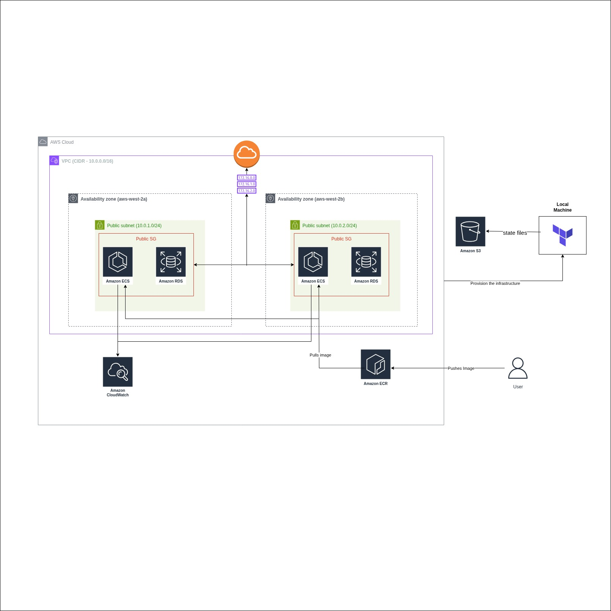

# WordPress on AWS ECS Fargate with RDS (Terraform)

## Objective
Deploy a production-grade WordPress application on AWS using:

- ECS Fargate for compute
- RDS MySQL as the database
- Terraform for infrastructure provisioning
- S3 as Terraform remote backend

This deployment follows best practices with security groups, IAM, networking, and modular Terraform code.

---
---

## 📄 Architecture Diagram



---
##  Prerequisites

Before running the project, ensure the following:

- AWS Account
- IAM user with programmatic access and Admin/Power access
- AWS CLI installed and configured  
  ```bash
  aws configure
  ```
- Terraform installed  
- An S3 bucket created for Terraform remote state (edit backend.tf accordingly)

---

##  Project Structure

```
├── backend.tf
├── main.tf
├── modules
│   ├── ecr
│   ├── ecs
│   ├── rds
│   ├── security
│   └── vpc
├── outputs.tf
├── provider.tf
├── terraform.tfvars
└── variables.tf
```

Each module contains isolated configurations for VPC, ECS, ECR, RDS, and Security Groups.

---

##  How to Deploy

### 1️⃣ Initialize Terraform
```bash
terraform init
```

### 2️⃣ Validate Configuration
```bash
terraform validate
```

### 3️⃣ Preview Deployment
```bash
terraform plan
```

### 4️⃣ Apply Deployment
```bash
terraform apply
```

When prompted, enter `yes`.

---

## 🐳 Push WordPress Image to ECR

After deployment, push the container image to the ECR repository created:

```bash
aws ecr get-login-password --region <region> | \
docker login --username AWS --password-stdin <aws_account_id>.dkr.ecr.<region>.amazonaws.com

docker build -t wordpress .

docker tag wordpress:latest \
<aws_account_id>.dkr.ecr.<region>.amazonaws.com/<repo_name>:latest

docker push \
<aws_account_id>.dkr.ecr.<region>.amazonaws.com/<repo_name>:latest
```

ECS will automatically pull the new image on update.

---

##  Access WordPress

Once the ECS service is running:

- Open the Load Balancer public DNS in the browser
- Complete the WordPress setup wizard

---

##  Cleanup

To remove all deployed AWS resources:

```bash
terraform destroy
```

Then manually remove the S3 state bucket if needed.


##  Notes

- This is a minimal working deployment.
- Extend modules as required for production (private subnets, NAT, HTTPS, ALB, etc.).
- Task definition requires database environment variables for WordPress to connect to RDS.

---
